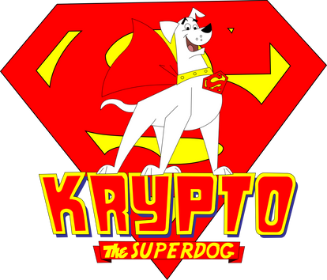

# 🦴 Krypto the Superdog: Training Guide

_Krypto may have powers from Krypton, but even a super dog needs super training._

<figure><figcaption></figcaption></figure>

## 🛡️ Step 1: Understand Krypto’s Powers

Before training begins, familiarize yourself with Krypto’s abilities:

* Super strength
* Flight
* Heat vision
* X-ray vision
* Super speed
* Super hearing
* Near invulnerability
* Dog-level attention span

> 📝 **Trainer Tip:** Krypto is loyal, but impulsive. Training must combine positive reinforcement with clear boundaries.

## 🎯 Step 2: Establish Trust and Obedience

Start with the basics—yes, even for a Kryptonian canine.

### ✅ Commands to teach:

* `Sit`
* `Stay`
* `Come`
* `Heel`
* `Drop it`

### 🦴 Use Kryptonian-approved treats:

* Solar-charged beef jerky
* Squeaky toy shaped like Brainiac
* Gold K-bone chew toy

### 📢 Reinforce with:

* Verbal praise (“Good boy, Krypto!”)
* Affection (scratches behind super ears)
* Play (zero-gravity fetch in the Fortress of Solitude)

## 🚀 Step 3: Flight Control Training

Uncontrolled flight = accidental sonic booms.

### 🛠️ Training routine:

1. **Takeoff on command:** Use cue like “Fly.”
2. **Hover drills:** Practice hovering at increasing heights.
3. **Landing precision:** Teach soft landings in designated zones.

> 🔄 Practice in remote areas or Superman’s training dome.

## 🔥 Step 4: Safe Use of Superpowers

Krypto must learn restraint.

### 🔥 Heat Vision Control:

* Target practice using dummy robots
* Use command like “Eyes off!” to disengage
* Introduce sunglasses for voluntary power suppression

### 🔊 Super Bark Management:

* Use bark-to-speak translator collar
* Practice whisper barks with decibel meter

## 🧠 Step 5: Distraction Resistance

### 🧪 Simulated distractions:

* Fake Lex Luthor drones
* Cat-shaped Kryptonite decoys
* Mail carriers (earth-style test)

> 🎯 Reward when Krypto maintains focus despite chaos.

## 🕵️ Step 6: Patrol Protocol

Krypto must understand when he’s on-duty.

### Assign roles:

* **Patrol mode:** Respond to emergencies only
* **Play mode:** Free to chase asteroids and butterflies

Use suit color changes (e.g. red = patrol, blue = play) as visual cues.

## 💼 Step 7: Teamwork With Superman

Sync commands with Superman’s voice frequency.

* Practice joint exercises (e.g. tandem rescues)
* Use Fortress holograms for simulated missions
* Develop emergency recall word (e.g. “Smallville!”)

## 💬 Step 8: Communication Upgrades

If Krypto uses a translator collar, expand his vocabulary:

* “Citizen in distress”
* “Alien threat detected”
* “Did you see me do that backflip?”

## 🏅 Step 9: Certification & Honor

Once training is complete:

* Present him with the **Super Canine Medal of Valor**
* Host a ceremony in Metropolis
* Let him lead the Justice League Pets

## 🐾 Final Notes

Training Krypto is more than obedience—it's about helping him become a hero in his own right. Be patient, consistent, and always have backup treats from the Phantom Zone pantry.

> “With great power comes great… belly rubs.” – Probably Batman
